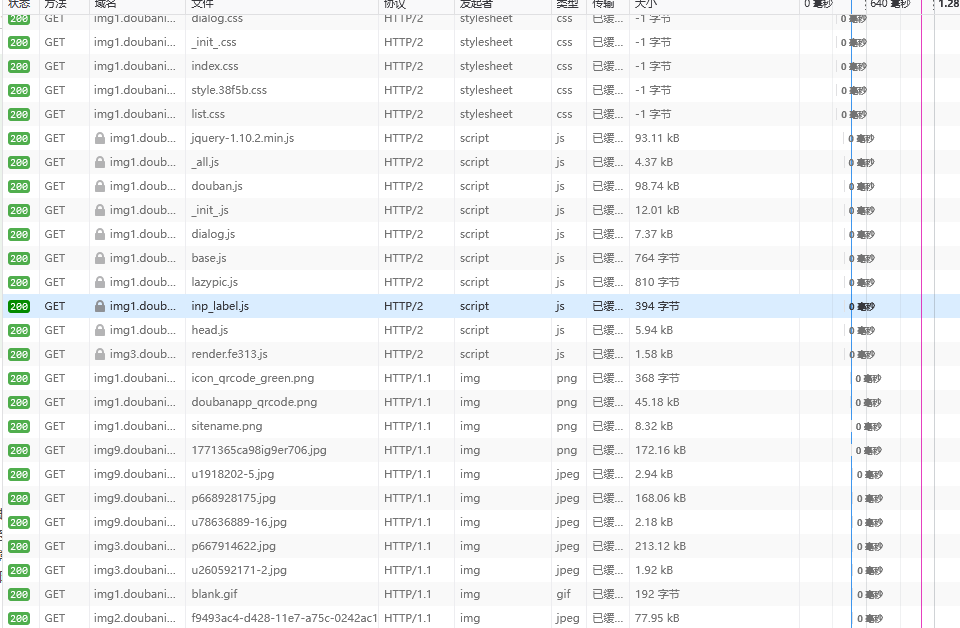
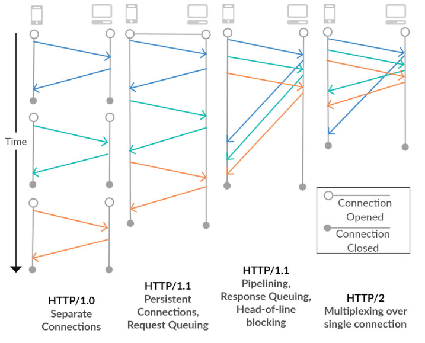
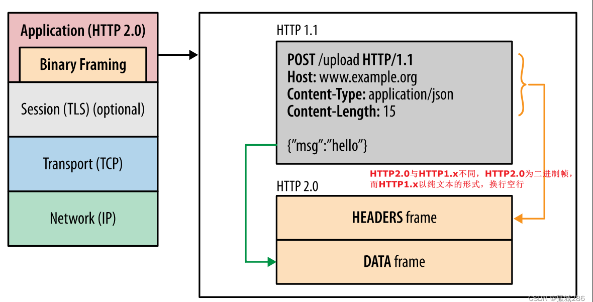
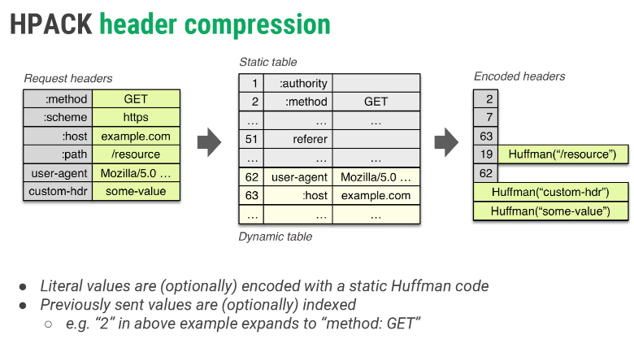

## HTTP2
### 判断HTTP1和HTTP2

### HTTP2的优势
1. 多路复用(Multiplexing): HTTP/2只需要一个连接就可以实现多个请求和响应，而HTTP/1.1每个请求都需要建立一个连接。

2. 二进制分帧: HTTP/2在应用层和传输层之间增加了一个二进制分帧层，将所有传输的信息分割为更小的消息和帧，并对它们进行二进制编码。

3. 头部压缩: HTTP/2使用HPACK算法对首部进行压缩，减少了首部的大小。

