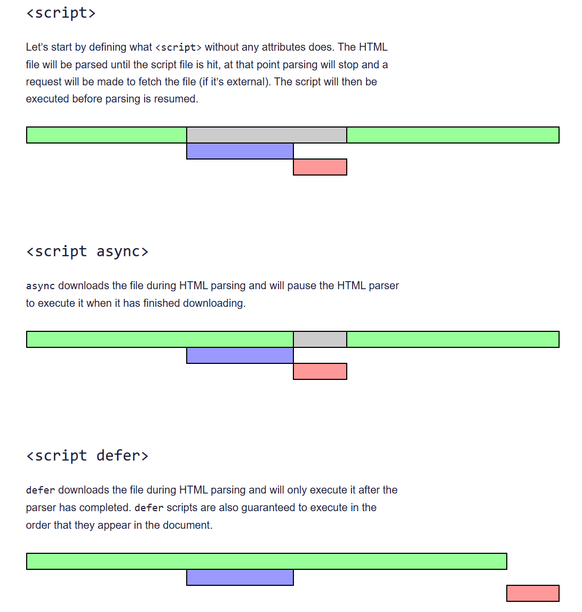

## 1. 渐进式web应用
### PWA技术
这个技术支持PC的和h5的，主要是为了提高用户体验，让用户在没有网络的情况下也能访问网站，这个技术是渐进式的，可以逐步的增加功能，不需要一次性全部实现。

首先创建一个JSON文件，这个文件是一个配置文件，里面包含了一些基本的信息，比如应用的名称，应用的图标，应用的启动页面等等。

```json manifest.json
{
    "name": "App",
    "short_name": "App",
    "display": "standalone",
    "start_url": "/",
    "icons":[
        {
            "src": "./logo/logo.png",
            "sizes": "256x256",
            "type": "image/png"
        }
    ]
}
```
使用方法  link标签引入
```html
<link rel="manifest" href="manifest.json">
```


## 2. 离线缓存技术
service worker技术
```html
<script>
    <script>
        //使用这个方法注册service worker
        navigator.serviceWorker.register('./service-worker.js')
    </script>
</script>
```
#### Service worker生命周期
 - 注册
 ```js
 self.addEventListener('install', function(event) {

    //做缓存
    //event.waitUntil()让你往后传递promise，直到这个promise被resolve之前，service worker不会安装完成
    //在service worker 有个全局变脸caches，可以用来缓存文件
    event.waitUntil(
        caches.open('v1.0.0').then(cache=>{
            return cache.addAll([
                '/index.html',//缓存的东西
                '/index.css',
                'manifest.json',
            ])
        })
    )
 })
 ```
 - 安装
 ```js
 self.addEventListener('activate',async function(event) {   
    console.log('activate');
     
    //控制版本更新
    self.clients.claim()//这个方法就是 离线缓存的核心，它会让service worker立即控制页面  离线缓存默认第二次进入页面生效
    //因为浏览器存的是旧的service worker，所以需要在activate事件中调用self.clients.claim()方法，这样新的service worker就会立即控制页面
    event.waitUntil(
        Promise.all([
            caches.keys().then(cacheNames=>{
                return Promise.all(
                    cacheNames.map(cacheName=>{
                        if(cacheName !== 'v1.0.0'){
                            return caches.delete(cacheName)
                        }
                    }))
            })]
        ))})
 ```
 - 激活

:::tip
1. 他是独立于线程执行的
2. serbice worker不能直接操作DOM 也没有window对象
3. 他可以通过postMessage和页面通信
4. 它里面的api都是基于promise的
5. 必须是https协议 或者127.0.0.1 或者localhost
:::

## 3. 消息推送
1. 检查是否订阅消息
    ```js
        registration.pushManager.getSubscription().then(subscription=> {
        if (subscription) {
            console.log('已经订阅',JSON.stringify(subscription));
            //调接口发送给后端
        }else {
            subscribe(registration)
            console.log('没有订阅',subscription);
        }})
    ```
2. 订阅消息
    ```js
        function subscribe(swgReg){
        swgReg.pushManager.subscribe({
            userVisibleOnly: true,//是否可见
            applicationServerKey:urlB64ToUint8Arr   ('BCVpOoEWzYKJYgOfYIWKeYZQpdTmHGN2dmQC4OE')//公钥
        }).then(subscription=> {
            console.log('订阅成功',subscription)
        }).catch(err=> {
            console.log('订阅失败',err);
        })
        }
    ```
3. 生成公钥和私钥
4. 使用公钥和私钥生成订阅消息
    ```js
        function urlB64ToUint8Array(base64String) {
            const padding = '='.repeat((4 - base64String.length % 4) % 4);
            const base64 = (base64String + padding)
                .replace(/\-/g, '+')
                .replace(/_/g, '/');
            const rawData = window.atob(base64);
            const outputArray = new Uint8Array(rawData.length);
            for (let i = 0; i < rawData.length; ++i) {
                outputArray[i] = rawData.charCodeAt(i);
            }
            return outputArray;
        }
    ```
:::tip goole公钥
web-push-codelab.glitch.me
:::
5. 发送消息
```js
    import webPush from 'web-push'

    webPush.setVapidDetails(
    'mailto:228768@qq.com',
    'BCVpOoEWzYKJYgOfYHG9tN2dmQC4mTqOE',//公钥
    '8kaBWf-aksHU4tJ5PPoQ'//私钥
    )

    const subscription = {"endpoint":"https://fcm.googleapis.com/fcm/send/eblhhOvoMVE:APA91bE3TLeDQwB8LBj4OV2gWW6xB0In_D1LfCj658kdR",
    "expirationTime":null,
    "keys":
    {"p256dh":"SHrVB5efH1ZvGDunaXNyK5n5M","auth":"E0-Hxm1tPIKL2bzhxOemgA"}
    }   

    webPush.sendNotification(subscription,'这是一条推送消息')
```
:::tip 之前怎么订阅消息
- websocket
- 轮询
- sse
- pwa消息推送
:::
## navigator
原生和硬件交互
navigator是一个全局对象，包含了一些属性和方法，可以用来获取浏览器的信息，比如浏览器的版本，浏览器的语言，浏览器的插件等等。

1. 离线缓存技术
```js(
    if (navigator.serviceWorker) {
        navigator.serviceWorker.register('./service-worker.js').then(function(registration){
            console.log('service worker注册成功');
        }).catch(function(err){
            console.log'service worker注册失败');
        });
    }
```
2. webRTC音视频通话技术
```js
    navigator.getUserMedia({audio:true,video:true},function(stream){
        var video = document.querySelector('video');
        video.srcObject = stream;
        video.onloadedmetadata = function(e){
            video.play();
        }
    },function(err){
        console.log(err);
    });
```
3. webGPU技术
```js
    navigator.gpu.requestAdapter().then(function(adapter){
        console.log(adapter);
    });
```
4. webSeraice技术
```js
    navigator.serviceWorker.register('./service-worker.js').then(function(registration){
        console.log('service worker注册成功');
    }).catch(function(err){
        console.log('service worker注册失败');
    });
```
5. webContainer技术
```js
    navigator.storage.estimate().then(function(estimate){
        console.log(estimate);
    });
```
6. 获取电脑硬件信息
```js
        navigator.getBattery().then(function(battery) {
            console.log(battery.level);
            console.log(battery.charging);
            console.log(battery.chargingTime);
            console.log(battery.dischargingTime);
            battery.addEventListener('chargingchange', function() {
                console.log('电池充电状态改变');
            });
            battery.addEventListener('chargingtimechange', function() {
                console.log('电池充电时间改变');
            });
            battery.addEventListener('dischargingtimechange', function() {
                console.log('电池放电时间改变');
            });
            battery.addEventListener('levelchange', function() {
                console.log('电池电量改变');
            });
        });
```
7. 防止偷窥 防止截图 防止录屏


## async defer
:::warning
async: 异步加载，加载完后立即执行
defer: 异步加载，等到文档解析完后执行
:::

### Notification
Notification.requestPermission() 询问用户是否允许通知

new Notification() 创建通知
```js
        // web Notification技术
        Notification.requestPermission().then(function(result) {
            if (result === 'granted') {
                console.log('用户同意通知');
            }else if (result === 'denied') {
                console.log('用户拒绝通知')}
        });
        new Notification('通知', {
            body: '这是一个通知',
            icon: './logo/logo.png'
        });
```

