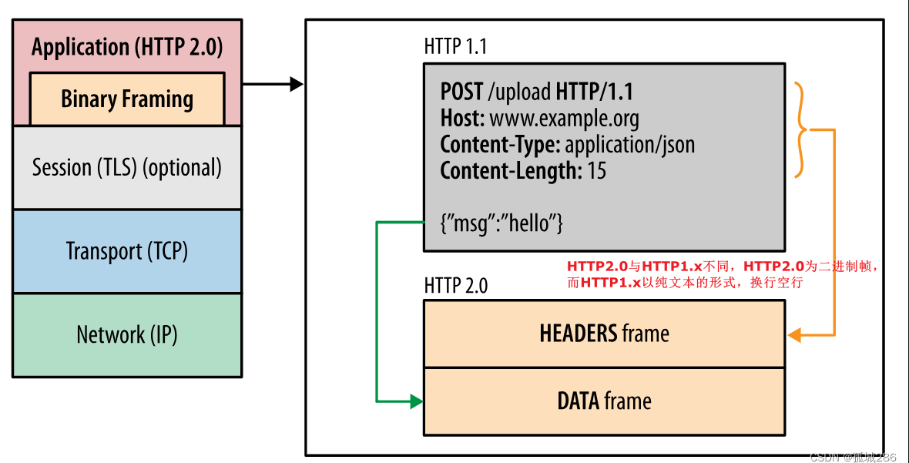
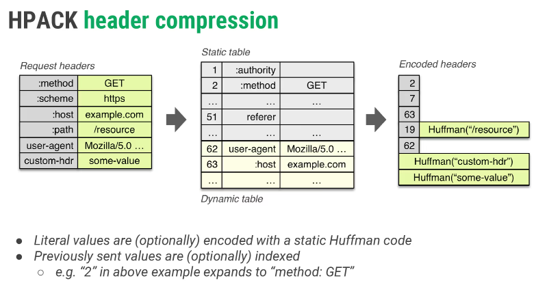
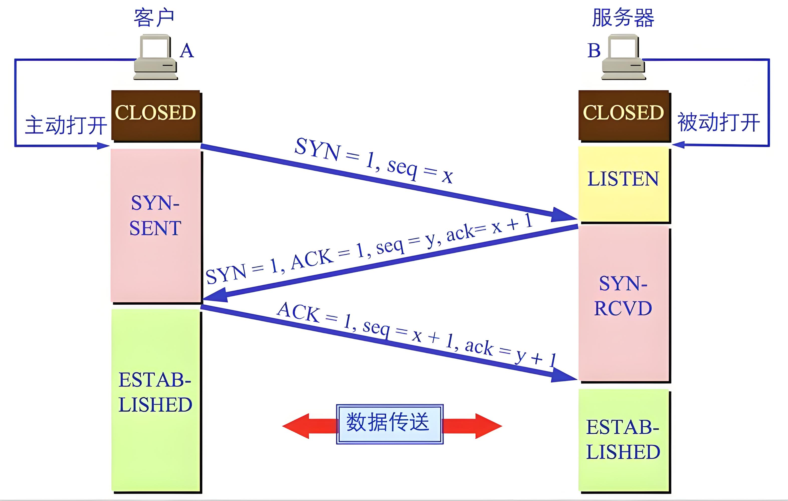
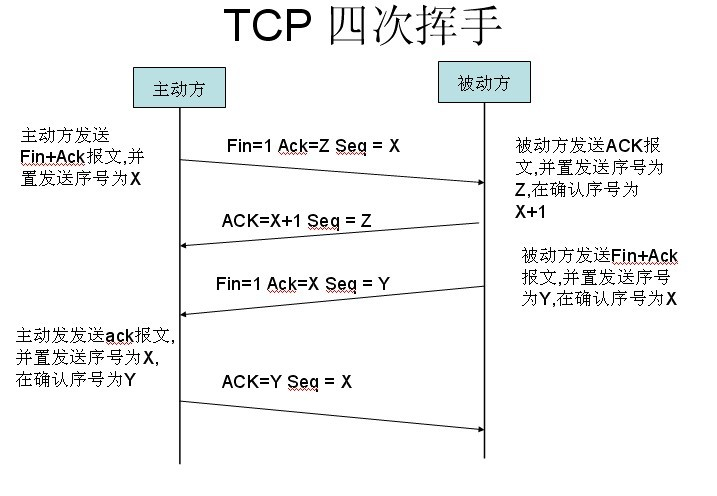

## 响应头、请求头
### 响应头
HTTP响应头是服务器端发送给客户端的HTTP头信息部分，它包含了关于服务器的信息和响应的信息。响应头是由服务器生成的，然后发送给客户端。响应头包含了HTTP响应的状态码、HTTP版本、服务器信息、内容类型、内容长度、内容编码、内容过期时间等信息。他们以键值对的形式出现，每个键值对由一个标头字段名和一个标头字段值组成，中间用冒号分隔。
```js
Access-Control-Allow-Origin: *
Content-Type: text/html; charset=utf-8
Cache-Control: no-cache
```
### 响应头和跨域
跨域资源共享（CORS）是一种机制，它使用额外的HTTP头来告诉浏览器，让运行在一个 origin（domain）上的Web应用被准许访问来自不同源服务器上的指定的资源。当一个资源从与该资源本身所在的服务器不同的域、协议或端口请求一个资源时，资源会发起一个跨域HTTP请求。
:::warning
CORS是一个W3C标准，它允许浏览器向跨源服务器，发出XMLHttpRequest请求，从而克服了AJAX只能同源使用的限制。
同源策略要求两个页面具有相同的协议、端口和域名，如果不满足这三个条件，就是跨域。
:::
```js '*'支持所有的的请求源 容易被攻击
Access-Control-Allow-Origin: *
```
```js Origin: http://www.example.com // 请求源
Access-Control-Allow-Origin: http://www.example.com // 允许的请求源
```
### 请求头
默认情况下CORS只支持客户端向服务器发送九个请求头，如果需要发送其他请求头，需要在请求头中添加
1. Accept：指定客户端能够接收的内容类型
2. Accept-Language：指定客户端当前的语言
3. Content-Language：请求的内容采用的语言
4. Content-Type：请求的与实体对应的MIME信息
5. Cookie：当前页面设置的任何Cookie
6. Origin：请求源
7. Referer：该请求是从哪个页面发过来的
8. User-Agent：浏览器的用户代理字符串
9. Authorization
```js
Access-Control-Request-Headers: X-PINGOTHER, Content-Type
``` 
#### 请求方法支持
默认只支持GET、POST、HEAD、OPTIONS请求，如果需要支持其他请求方法，需要在响应头中添加
如果我们要遵循restful风格，我们需要支持DELETE、PUT、PATCH等请求方法
:::tip restful风格
RESTful是一种软件架构风格，是一种设计风格而不是标准，只是提供了一组设计原则和约束条件。REST是Representational State Transfer的缩写，中文意思是表现层状态转化。RESTful是REST的具体实现。
:::
```js
Access-Control-Allow-Methods: GET, POST, PUT, DELETE, PATCH
```

### 预检请求
预检请求主要是为了解决跨域请求中的安全问题，浏览器会先发送一个OPTIONS请求，然后根据服务器返回的响应，决定是否发送真正的请求。
:::tip 预检请求触发条件
1. 使用了非简单请求方法，如PUT、DELETE、CONNECT、OPTIONS、TRACE、PATCH
2. 使用了非简单请求头，如Content-Type、Authorization、Accept
3. 请求中的Content-Type不是application/x-www-form-urlencoded、multipart/form-data、text/plain
:::
```js
//预检请求 OPTIONS 请求 浏览器发起的
//满足一下条件才会发起
//1.请求方法是PUT、DELETE、PATCH
//2.请求头中有自定义字段
//3.请求头中有Content-Type

app.post('/info', (req, res) => {
    res.json({
        code: 200,
        type:'post'
    })
})
```
```js
        fetch('http://localhost:3000/info',).then(response => {
            let headers = response.headers
            console.log(headers.get('xmzs'));
            return response.json();
        }).then(data => {
            console.log(data);
        })
```
### 自定义请求头
在请求头中添加自定义请求头，需要在响应头中添加Access-Control-Expose-Headers字段，告诉浏览器哪些自定义请求头可以暴露给客户端
```js
app.get('/info', (req, res) => {
    res.set('xmzs','132456')
    res.setHeader('Access-Control-Expose-Headers','xmzs')
    res.json({
        code: 200,
        type:'get'
    })
})
```
```js
        fetch('http://localhost:3000/info',).then(response => {
            let headers = response.headers
            console.log(headers.get('xmzs'));
            return response.json();
        }).then(data => {
            console.log(data);
        })
```

### SSE
SSE（Server-Sent Events）是一种服务器推送技术，它允许服务器向客户端发送事件，而不是客户端请求数据。SSE是基于HTTP协议的，所以它只能从服务器到客户端单向发送数据，而不能从客户端到服务器发送数据。SSE是基于事件的，服务器发送的数据是一个事件流，客户端通过监听事件来获取数据。
:::tip Websocket
WebSocket是一种双向通信协议，它允许客户端和服务器之间建立一个持久的连接，双方可以随时向对方发送数据。WebSocket是基于TCP协议的，它是一个独立的协议，不依赖HTTP协议。WebSocket是全双工通信的，客户端和服务器可以同时向对方发送数据。
:::
:::tip SSE
1. SSE是基于HTTP协议的，所以它只能从服务器到客户端单向发送数据，而不能从客户端到服务器发送数据。
2. SSE是基于事件的，服务器发送的数据是一个事件流，客户端通过监听事件来获取数据。
3. SSE是基于长连接的，服务器发送的数据是一个持久的连接，客户端和服务器之间保持一个长连接。
4. SSE是基于文本的，服务器发送的数据是文本格式，客户端通过监听事件来获取数据。
:::

```js
app.get(
    '/sse',
    (req, res) => {
        res.setHeader('Content-Type', 'text/event-stream')
        setInterval(() => {
            res.write('event: test\n')
            res.write('data: hello\n\n'+Date.now())
        }, 1000)
    }
)
```
```js
        let eventSource = new EventSource('http://localhost:3000/sse')
        eventSource.onmessage = (event) => {
            console.log(event.data)
        }
```

## HTTP2
### 判断HTTP1和HTTP2

### HTTP2的优势
1. 多路复用(Multiplexing): HTTP/2只需要一个连接就可以实现多个请求和响应，而HTTP/1.1每个请求都需要建立一个连接。

2. 二进制分帧: HTTP/2在应用层和传输层之间增加了一个二进制分帧层，将所有传输的信息分割为更小的消息和帧，并对它们进行二进制编码。

3. 头部压缩: HTTP/2使用HPACK算法对首部进行压缩，减少了首部的大小。


## 浏览器缓存
:::tip
浏览器缓存分为强缓存和协商缓存，强缓存是根据http头信息来判断是否使用缓存，协商缓存是根据服务器返回的状态码来判断是否使用缓存。
:::
### 强缓存
强缓存之后，浏览器不会向服务器发送请求，而是从浏览器分别读取内存缓存和硬盘缓存中获取资源，所以强缓存是可以直接使用的，不会发起请求，状态码为200。
1. 内存缓存和硬盘缓存
- memory cache: 内存缓存，存储在浏览器内存当中，一般刷新网页会发现很多内存缓存，主要用于缓存css和js文件，内存缓存虽然读取高效，但是缓存空间小，且一旦关闭浏览器就会被清除。
- disk cache: 硬盘缓存，存储在硬盘中，一般存储一些静态资源，如图片、音频、视频等，硬盘缓存虽然读取速度慢，但是容量大，而且可以持久保存。

2. Expires
Expires是HTTP/1.0的产物，表示资源过期时间，浏览器再次加载资源时，会根据资源的过期时间判断是否发送请求到服务器。Expires是服务器返回的响应头字段，告诉浏览器在过期时间前可以直接从浏览器缓存中获取资源，而无需再次请求。Expires是一个绝对时间，即使本地时间和服务器时间存在偏差，也不会影响缓存的使用。
- Expires 该字段制定缓存的到期时间
- 判断机制：当客户端请求资源时，或获取本地时间戳，与Expires进行比较，如果本地时间戳小于Expires时间戳，则直接使用缓存，否则向服务器请求资源。
```js
//动态资源缓存 接口
//Expires 强缓存
app.get('/api',(req,res)=>{
    res.setHeader('Expires',new Date(Date.now()+1000).toUTCString())
    res.send('Expires')
})
```
3.cache-control
Cache-Control是HTTP/1.1的产物，优先级高于Expires，当Cache-Control与Expires同时存在时，Cache-Control优先级高。Cache-Control的值有多种，常见的值如下：
- public: 表示响应可以被客户端和代理服务器缓存
- private: 表示响应只能被客户端缓存，而不能被代理服务器缓存
- no-cache: 表示不使用强缓存，需要使用协商缓存
- no-store: 表示不使用任何缓存，即不进行缓存存储
- max-age: 表示资源在本地缓存多少秒
- s-maxage: 覆盖max-age，作用于代理服务器缓存
- must-revalidate: 表示客户端必须验证缓存，即发送请求到服务器确认资源是否有更新 
- proxy-revalidate: 与must-revalidate类似，但只作用于代理服务器缓存
- no-transform: 代理服务器不得对资源进行转换
- immutable: 表示资源不会发生改变，可以直接使用缓存
- stale-while-revalidate: 表示资源过期后，依然可以使用缓存，但同时发起请求到服务器更新资源
- stale-if-error: 表示资源过期后，依然可以使用缓存，但是当资源失效时，返回错误码
```js
//Cache-Control 强缓存
//PUBLIC 共有缓存 任何服务器都可以缓存包括代理服务器 CDN
//PRIVATE 私有缓存 只有浏览器可以缓存
//MAX-AGE=60 60秒后过期
//Expires 和 Cache-Control 同时存在时 Cache-Control的max-age 优先级高
app.get('/api1',(req,res)=>{
    res.setHeader('Cache-Control','public,max-age=10')
    res.send('Cache-Control')
})
```
:::warning
强缓存和协商缓存是可以一起使用的，强缓存优先级高于协商缓存，即当强缓存生效时，浏览器直接使用缓存，不会再发起请求到服务器。
:::

### 协商缓存
协商缓存是强缓存失效后，浏览器携带缓存标识向服务器发送请求，由服务器根据缓存标识决定是否使用缓存的过程。协商缓存可以分为两种情况：
1. Last-Modified和If-Modified-Since
```js
//强缓存与协商缓存一起出现，浏览器优先使用强缓存
//如何解决这个问题
//no-cache 告诉浏览器，不要使用强缓存，要使用协商缓存
//no-store 告诉浏览器，不要使用任何缓存
//last-modified 设置资源最后修改时间

const getFileModifyTime = (filePath) => {
    return fs.statSync('./index.js').mtime.toUTCString()
}
app.get('/api2', (req, res) => {
    res.setHeader('Cache-Control', 'no-cache')
    const fileModifyTime = getFileModifyTime()
    const ifModifiedSince = req.headers['if-modified-since']
    if (ifModifiedSince && ifModifiedSince === fileModifyTime) {
        console.log('协商缓存命中');
        
        res.statusCode = 304
        res.send('Not Modified')
        res.end()
        return
    }
    console.log('没有缓存');
    res.setHeader('Last-Modified', fileModifyTime)
    res.send('Cache-Control')
})
```
2. Etag和If-None-Match
```js
//Etag 和 If-None-Match
//Etag 是服务器生成的资源唯一标识
//If-None-Match 浏览器发送请求时，携带上次资源的Etag
//服务器根据If-None-Match判断资源是否更新，如果没有更新，返回304，否则返回新的资源
const getFileEtag = (filePath) => {
    return crypto.createHash('md5').update(fs.readFileSync(filePath)).digest('hex')
}
app.get('/api3', (req, res) => {
    res.setHeader('Cache-Control', 'no-cache')
    const fileEtag = getFileEtag('./index.js')
    const ifNoneMatch = req.headers['if-none-match']
    if (ifNoneMatch && ifNoneMatch === fileEtag) {
        console.log('协商缓存命中');
        res.statusCode = 304
        res.send('Not Modified')
        res.end()
        return
    }
    console.log('没有缓存');
    res.setHeader('Etag', fileEtag)
    res.send('Cache-Control')
})
```

## OSI七层模型

1. 物理层：主要作用是定义物理设备如何传输数据，包括传输介质、接口、传输速率等。
- 有限信道：双绞线、同轴电缆、光纤等
- 无限信道：无线电波、红外线等
:::tip
物理层的主要作用是传输`比特流`，不关心数据的含义，只关心数据的传输。
:::
2. 数据链路层：主要作用是将比特流组装成帧和在帧之间传输，以及差错检测和纠正。
使用MAC地址来标识设备，通过交换机进行数据传输。
- 帧：数据链路层的数据传输单位，包括数据和控制信息
- 差错检测：奇偶校验、CRC校验等
- 差错纠正：海明码、纠错码等
:::tip
数据链路层的主要作用是传输`帧`，并检测和纠正传输过程中的错误。
:::
3. 网络层：主要作用是将数据包从源主机传输到目的主机，包括寻址、路由选择、分组转发等。
使用IP地址来标识设备，通过路由器进行数据传输。
    - 寻址：对网络层而言使用IP地址来标识设备，依靠IP地址来确定数据包的目的地。
    - 路由：在同一个网络中，不需要网络层的路由功能，只需要数据链路层的交换机功能，而在不同网络中，需要网络层的路由功能。
4. 传输层：主要作用定义端口号，以及控流，和校检。
有两个主要的传输协议：TCP和UDP
    - TCP：面向连接的可靠传输协议，提供可靠的数据传输，保证数据的完整性和顺序性。
    - UDP：面向无连接的不可靠传输协议，提供高效的数据传输，但不保证数据的完整性和顺序性。
:::tip
传输层的主要作用是传输`报文`，并控制数据的传输。
:::
5. 会话层：主要作用是建立、管理和终止会话，包括会话的建立、会话的管理、会话的终止等。 
:::tip
会话层包含了一种称为检查点的机制，可以在通信过程中进行检查点的设置，以便在通信中断后，可以从检查点重新开始通信。
:::
6. 表示层：主要作用是数据的格式化、加密、压缩等，以便应用层能够正确解释数据。
    1. 安全性：数据加密、数据解密
    2. 数据格式：数据压缩、数据解压缩
:::tip
表示层的主要作用是对数据进行`格式化`，以便应用层能够正确解释数据。
:::
7. 应用层：主要作用是为用户提供应用服务，包括文件传输、电子邮件、远程登录等。
例如ajax调用接口发送http请求，DNS，SMTP

## TCP三次握手
TCP是一种面向连接的可靠传输协议，它通过三次握手建立连接，通过四次挥手断开连接。

:::tip
1. seq (sequence number)：序列号，用来标识数据段的顺序
2. ack (acknowledgement number)：确认号，用来确认数据段是否收到 ack=seq+1
3. SYN (synchronize)：同步序列号，用来建立连接
:::
### 流程
1. 客户端向服务器发送SYN报文，请求建立连接
2. 服务器收到SYN报文，回复SYN+ACK报文，表示同意建立连接
3. 客户端收到SYN+ACK报文，回复ACK报文，表示连接建立成功
4. 服务器收到ACK报文，连接建立成功

## TCP四次挥手
TCP四次挥手是指断开一个TCP连接时，需要发送四个包，使得连接两端都能关闭连接。
四次挥手的具体步骤
- 第一次挥手‌：客户端发送一个带有FIN标志的TCP包给服务器，表示客户端没有数据要发送了，但仍然可以接收数据。服务器收到后，发送一个ACK包进行确认，并进入CLOSE_WAIT状态，客户端进入FIN_WAIT_1状态。‌
- 第二次挥手‌：服务器发送一个ACK包给客户端，确认收到FIN包，并进入CLOSE_WAIT状态。客户端收到ACK包后，进入FIN_WAIT_2状态。
- 第三次挥手‌：服务器发送FIN包给客户端，表示服务器也没有数据要发送了，客户端收到后发送ACK包进行确认，并进入TIME_WAIT状态。服务器进入LAST_ACK状态。
- 第四次挥手‌：客户端发送最后一个ACK包给服务器，确认服务器的FIN包，服务器收到后进入CLOSED状态。客户端需要等待一段时间（通常是2倍的最大段生命周期MSL），如果没有收到服务器的重传FIN+ACK，则认为连接已关闭，最终也进入CLOSED状态。

## 浏览器输入URL发生了什么
- URL解析
:::tip
URL解析主要包括协议、域名、端口、路径、查询参数、锚点等信息。
:::
- DNS解析
DNS是域名对IP的映射
:::tip
DNS解析是将域名解析为IP地址的过程，浏览器会先查找本地缓存，如果本地缓存没有，会向DNS服务器发送请求，获取域名对应的IP地址。
- 浏览器缓存：浏览器会将DNS解析的结果缓存到本地，下次再次访问相同的域名时，会直接从本地缓存中获取IP地址。
- 操作系统缓存：操作系统也会将DNS解析的结果缓存到本地，下次再次访问相同的域名时，会直接从操作系统缓存中获取IP地址。
- 本地Host文件：本地Host文件是一个域名和IP地址的映射表，当浏览器访问一个域名时，会先查找本地Host文件，如果本地Host文件中有对应的IP地址，会直接使用本地Host文件中的IP地址。
:::
:::tip 向域名服务器发送请求
1. 根域名服务器：根域名服务器是最高级别的域名服务器，它负责管理顶级域名服务器，如.com、.cn、.org等。
2. 顶级域名服务器：顶级域名服务器是负责管理顶级域名的域名服务器，如.com域名服务器、.cn域名服务器、.org域名服务器等。
3. 权威域名服务器：权威域名服务器是负责管理域名的域名服务器，如baidu.com域名服务器、google.com域名服务器等。
:::
:::tip options请求
- 预检请求：预检请求是CORS中的一种请求，主要用于检查服务器是否支持跨域请求。
- 预检请求触发条件：预检请求主要是为了解决跨域请求中的安全问题，浏览器会先发送一个OPTIONS请求，然后根据服务器返回的响应，决定是否发送真正的请求。
- 预检请求触发条件：使用了非简单请求方法，如PUT、DELETE、CONNECT、OPTIONS、TRACE、PATCH；使用了非简单请求头，如Content-Type、Authorization、Accept；请求中的Content-Type不是application/x-www-form-urlencoded、multipart/form-data、text/plain。
:::
- TCP连接
:::tip
TCP连接是一种面向连接的可靠传输协议，它通过三次握手建立连接，通过四次挥手断开连接。
::: 
- 发送HTTP请求
:::tip
HTTP请求主要包括请求行、请求头、请求体等信息，请求行包括请求方法、请求路径、请求协议等信息，请求头包括请求头字段和请求头字段值，请求体包括请求的数据。
:::
- 服务器处理请求
:::tip
服务器接收到HTTP请求后，会根据请求的路径、请求的方法等信息，来处理请求，然后返回响应。
:::
- 浏览器解析响应
:::tip
浏览器接收到服务器返回的响应后，会根据响应的状态码、响应的头信息、响应的数据等信息，来解析响应。
:::
- 缓存处理
:::tip
浏览器会根据响应的头信息，来判断是否使用缓存，如果使用缓存，会直接从缓存中获取数据，而不会再次请求服务器。
:::
- 渲染页面
:::tip
浏览器会根据响应的数据，来渲染页面，包括解析HTML、解析CSS、解析JS、渲染页面等。
- 绘制DOM树：浏览器会根据HTML标签来构建DOM树，DOM树是浏览器内部的一个数据结构，用来表示页面的结构。
- 构建CSSOM树：浏览器会根据CSS样式来构建CSSOM树，CSSOM树是浏览器内部的一个数据结构，用来表示页面的样式。
- 渲染页面：浏览器会根据DOM树和CSSOM树来渲染页面，包括布局、绘制、合成等。
:::
### 回流与重绘
- 回流：当页面中的元素发生变化，导致页面的布局发生变化时，浏览器会重新计算元素的位置和大小，然后重新绘制页面，这个过程称为回流。
- 重绘：当页面中的元素的样式发生变化，但是布局没有发生变化时，浏览器会重新绘制元素的样式，这个过程称为重绘。
:::tip
回流是比重绘开销更大的一种操作，因为回流会导致页面的布局发生变化，需要重新计算元素的位置和大小，而重绘只需要重新绘制元素的样式。
:::
V8引擎会将JavaScript代码编译为字节码，然后再将字节码编译为机器码，最后再执行机器码。V8引擎是单线程的，所以JavaScript代码是单线程执行的，即同一时间只能执行一个任务。
:::tip
1. 宏任务：宏任务是由浏览器发起的任务，如定时器、事件等，宏任务会放到宏任务队列中，等待执行。
2. 微任务：微任务是由JavaScript发起的任务，如Promise、MutationObserver等，微任务会放到微任务队列中，等待执行。
:::


## AJAX
### get
`onreadystatechange`属性存储一个函数，当readyState属性改变时，会调用这个函数。
`timeout`属性设置请求超时时间，单位为毫秒。
`abort`方法用于中断请求。

```js
        const sendajax =()=>{
            const xhr = new XMLHttpRequest();
            //请求方式 请求地址 是否异步（默认为true）
            xhr.open('GET','http://localhost:3000/api/txt',true)

            // xhr.timeout = 1000
            
            // xhr.addEventListener('timeout',()=>{
            //     console.log('请求超时')
            // })

            xhr.addEventListener('abort',()=>{
                console.log('请求中断')
            })
            stop.addEventListener('click',()=>{
                xhr.abort()
            })

            xhr.addEventListener('progress',()=>{
                const progress = document.getElementById('progress')
                progress.innerText = `${(event.loaded/event.total*100).toFixed(2)}%`
            })

            xhr.onreadystatechange = ()=>{
                if(xhr.readyState === 4){
                    if(xhr.status === 200){
                        console.log(xhr.responseText)
                    }
                }
            }

            xhr.send(null)
        }
```
### POST
`setRequestHeader`方法用于设置请求头。
`send`方法用于发送请求，如果是POST请求，需要在send方法中传入请求体。
请求头中的`Content-Type`字段用于设置请求体的类型，常见的有`application/x-www-form-urlencoded`、`multipart/form-data`、`text/plain`等。

:::tip
1. application/x-www-form-urlencoded：表单数据，键值对的形式，如name=123&age=18
2. multipart/form-data：表单数据，支持文件上传
3. text/plain：纯文本数据

JSON 数据格式 要序列化
urlencoded 数据格式 不用序列化
:::
```js
        const sendajax =()=>{
            const xhr = new XMLHttpRequest();
            //请求方式 请求地址 是否异步（默认为true）
            xhr.open('POST','http://localhost:3000/api/txt',true)
            xhr.setRequestHeader('Content-Type','application/x-www-form-urlencoded')
            xhr.onreadystatechange = ()=>{
                if(xhr.readyState === 4){
                    if(xhr.status === 200){
                        console.log(xhr.responseText)
                    }
                }
            }

            xhr.send('name=123')
        }
```js
        const sendajax =()=>{
            const xhr = new XMLHttpRequest();
            //请求方式 请求地址 是否异步（默认为true）
            xhr.open('POST','http://localhost:3000/api/txt',true)
            xhr.setRequestHeader('Content-Type','application/x-www-form-urlencoded')
            xhr.onreadystatechange = ()=>{
                if(xhr.readyState === 4){
                    if(xhr.status === 200){
                        console.log(xhr.responseText)
                    }
                }
            }

            xhr.send('name=123')
        }
```
### 文件上传
1. 新建一个FormData对象 用于上传文件 
2. 通过append方法添加文件 'file'为后端接收文件的字段名 要与后端保持一致 file.files[0]为文件对象 
3. 一般不自己设置请求头 由浏览器自动设置（boundary一般有浏览器生成随机码加----）
```js
        //新建一个FormData对象 用于上传文件 通过append方法添加文件 'file'为后端接收文件的字段名 要与后端保持一致 file.files[0]为文件对象 一般不自己设置请求头 由浏览器自动设置 
        file.addEventListener('change',()=>{
            const formData = new FormData()
            formData.append('file',file.files[0])
            const xhr = new XMLHttpRequest();
            xhr.open('POST','http://localhost:3000/api/upload',true)
            // xhr.setRequestHeader('Content-Type','multipart/form-data')
            xhr.onreadystatechange = ()=>{
                if(xhr.readyState === 4){
                    if(xhr.status === 200){
                        console.log(xhr.responseText)
                    }
                }
            }
            xhr.send(formData)
        })
```
:::tip
addEventListener('load')
load事件会在页面或图像加载完成后立即发生。
可以替代`xhr.readyState === 4`
:::
```html AJAX完整代码
<!DOCTYPE html>
<html lang="en">
<head>
    <meta charset="UTF-8">
    <meta name="viewport" content="width=device-width, initial-scale=1.0">
    <title>Document</title>
</head>
<body>
    <div>
        <button>Sendajax</button>
        <h2><span id="progress"></span></h2>
        <button id="stop">中断请求</button>
        <input type="file" name="file" id="file">
    </div>
    <script>
        const btn = document.querySelector('button')
        const stop = document.getElementById('stop')
        const file = document.getElementById('file')

        //新建一个FormData对象 用于上传文件 通过append方法添加文件 'file'为后端接收文件的字段名 要与后端保持一致 file.files[0]为文件对象 一般不自己设置请求头 由浏览器自动设置 
        file.addEventListener('change',()=>{
            const formData = new FormData()
            formData.append('file',file.files[0])
            const xhr = new XMLHttpRequest();
            xhr.open('POST','http://localhost:3000/api/upload',true)
            // xhr.setRequestHeader('Content-Type','multipart/form-data')
            xhr.onreadystatechange = ()=>{
                if(xhr.readyState === 4){
                    if(xhr.status === 200){
                        console.log(xhr.responseText)
                    }
                }
            }
            xhr.send(formData)
        })


        const sendajax =()=>{
            const xhr = new XMLHttpRequest();
            //请求方式 请求地址 是否异步（默认为true）
            // xhr.open('GET','http://localhost:3000/api/txt',true)
            xhr.open('POST','http://localhost:3000/api/txt',true)
            //设置请求头 一定要在open之后
            // xhr.setRequestHeader('Content-Type','application/json')
            xhr.setRequestHeader('Content-Type','application/x-www-form-urlencoded')

            // xhr.timeout = 1000
            
            // xhr.addEventListener('timeout',()=>{
            //     console.log('请求超时')
            // })

            xhr.addEventListener('abort',()=>{
                console.log('请求中断')
            })
            stop.addEventListener('click',()=>{
                xhr.abort()
            })

            xhr.addEventListener('progress',()=>{
                const progress = document.getElementById('progress')
                progress.innerText = `${(event.loaded/event.total*100).toFixed(2)}%`
            })

            xhr.onreadystatechange = ()=>{
                if(xhr.readyState === 4){
                    if(xhr.status === 200){
                        console.log(xhr.responseText)
                    }
                }
            }
            //传递JSON数据一定要序列化
            //urlencoded格式的数据不需要序列化
            xhr.send('name:zhangsan&age:18')
        }
    </script>
</body>
</html>
```
## fetch
### GET POST
fetch是一种新的网络请求方式，它是基于Promise的，可以替代XMLHttpRequest。
fetch的基本用法如下：
```js
            fetch('http://localhost:3000/txt',{
                signal:abort.signal
            }).then(res=>{
                return res.text()
            }).then(data=>{
                console.log(data)
            })

            fetch('http://localhost:3000/post',
                {
                    method:'POST',
                    headers:{
                        'Content-Type':'application/json'
                    },
                    body:JSON.stringify({name:'zhangsan'})
                }
            ).then(res=>{
                //post 请求返回的是一个json对象
                return res.json()
            }).then(data=>{
                console.log(data)
            })
```
### progress
fetch可以通过`getReader`来获取reader对象
```js
            fetch('http://localhost:3000/txt').then(async res=>{
                const response = res.clone()
                const reader = res.body.getReader()//返回一个reader对象
                const total = res.headers.get('Content-Length')
                let loaded = 0
                // reader.read().then(function processResult(result){
                //     if(result.done){
                //         console.log('读取完毕')
                //         return
                //     }
                //     loaded += result.value.byteLength
                //     console.log(`加载进度${loaded}/${total}`)
                //     document.getElementById('progress').innerText = `${loaded}/${total}`
                //     return reader.read().then(processResult)
                // })
                while(true){
                    const {done,value} = await reader.read()
                    if(done){
                        console.log('读取完毕')
                        break
                    }
                    loaded += value.byteLength
                    console.log(`加载进度${loaded}/${total}`)
                    document.getElementById('progress').innerText = `${loaded}/${total}`
                }
                return response.text()
            }).then(data=>{
                console.log(data)
            })

            stop.addEventListener('click',()=>{
                abort.abort()
            })
```
### abort
fetch可以通过`AbortController`来中断请求
```js
            const abort = new AbortController()
            fetch('http://localhost:3000/txt',{
                signal:abort.signal
            }).then(res=>{
                return res.text()
            }).then(data=>{
                console.log(data)
            })

            stop.addEventListener('click',()=>{
                abort.abort()
            })
```
## SSE
SSE是一种服务器推送技术，它允许服务器向客户端发送事件，而不是客户端请求数据。SSE是基于HTTP协议的，所以它只能从服务器到客户端单向发送数据，而不能从客户端到服务器发送数据。SSE是基于事件的，服务器发送的数据是一个事件流，客户端通过监听事件来获取数据。
适用场景：实时数据更新、消息推送、日志输出等。
### 主要API
1. EventSource：用于创建一个SSE对象
```js
        let eventSource = new EventSource('http://localhost:3000/sse')
        eventSource.onmessage = (event) => {
            console.log(event.data)
        }
        //监听事件 事件默认为message 后端可以改变  前端监听的事件名要与后端一致
        eventSource.addEventListener('test',(event)=>{
            console.log(event.data)
        })
```
2. onopen：连接建立时触发
```js
        eventSource.onopen = (event) => {
            console.log('连接建立')
        }
```
3. onmessage：接收到消息时触发
```js
        eventSource.onmessage = (event) => {
            console.log(event.data)
        }
```
4. onerror：连接出错时触发
```js
        eventSource.onerror = (event) => {
            console.log('连接出错')
        }
```
5. close：关闭连接
```js
        eventSource.close()
```
### 服务器端
```js
app.get(
    '/sse',
    (req, res) => {
        res.writeHead(200, {
            'Content-Type': 'text/event-stream',//核心
            'Cache-Control': 'no-cache',//不缓存
            'Connection': 'keep-alive'// 保持长连接
        })
        const txt = 'data: hello\ns\nd\nadsa\n\nsadasd\n\n'
        const arr = txt.split('\n')
        let current = 0
        let timer = setInterval(() => {
            if (current < arr.length) {
                res.write(arr[current])
                current++
            }else{
                ClearInterval(timer)
            }
        }, 1000)
    }
)
```
完整代码
```js
        const btn = document.querySelector('button')
        const stop = document.getElementById('stop')
        const file = document.getElementById('file')
        const abort = new AbortController()

        const sendFetch = ()=>{
            //后端可能返回的对象
            //blob对象
            //json对象
            //formData对象
            //arrayBuffer对象
            //text对象
            //res.text().then(data=>console.log(data))
            fetch('http://localhost:3000/txt',{
                signal:abort.signal
            }).then(res=>{
                return res.text()
            }).then(data=>{
                console.log(data)
            })

            fetch('http://localhost:3000/post',
                {
                    method:'POST',
                    headers:{
                        'Content-Type':'application/json'
                    },
                    body:JSON.stringify({name:'zhangsan'})
                }
            ).then(res=>{
                //post 请求返回的是一个json对象
                return res.json()
            }).then(data=>{
                console.log(data)
            })
            fetch('http://localhost:3000/txt').then(async res=>{
                const response = res.clone()
                const reader = res.body.getReader()//返回一个reader对象
                const total = res.headers.get('Content-Length')
                let loaded = 0
                // reader.read().then(function processResult(result){
                //     if(result.done){
                //         console.log('读取完毕')
                //         return
                //     }
                //     loaded += result.value.byteLength
                //     console.log(`加载进度${loaded}/${total}`)
                //     document.getElementById('progress').innerText = `${loaded}/${total}`
                //     return reader.read().then(processResult)
                // })
                while(true){
                    const {done,value} = await reader.read()
                    if(done){
                        console.log('读取完毕')
                        break
                    }
                    loaded += value.byteLength
                    console.log(`加载进度${loaded}/${total}`)
                    document.getElementById('progress').innerText = `${loaded}/${total}`
                }
                return response.text()
            }).then(data=>{
                console.log(data)
            })

            stop.addEventListener('click',()=>{
                abort.abort()
            })

            
        }
```
## WebSocket
WebSocket是一种双向通信协议，它允许客户端和服务器之间建立一个持久的连接，双方可以随时向对方发送数据。WebSocket是基于握手协议的，它是一个独立的协议，不依赖HTTP协议。WebSocket是全双工通信的，客户端和服务器可以同时向对方发送数据。
适用场景：实时聊天、实时数据更新、在线游戏等。
### 主要API
1. WebSocket：用于创建一个WebSocket对象
```js
        let ws = new WebSocket('ws://localhost:3000')
```
2. onopen：连接建立时触发
```js
        ws.onopen = (event) => {
            console.log('连接建立')
        }
```
3. onmessage：接收到消息时触发
```js
        ws.onmessage = (event) => {
            console.log(event.data)
        }
```
4. onerror：连接出错时触发
```js
        ws.onerror = (event) => {
            console.log('连接出错')
        }
```
5. onclose：连接关闭时触发
```js
        ws.onclose = (event) => {
            console.log('连接关闭')
        }
```
6. send：发送消息
```js
        ws.send('hello')
```
7. close：关闭连接
```js
        ws.close()
```
### websocket广播消息
```js
const WebSocket = require('ws')
const wss = new WebSocket.Server({ port: 3000 })
wss.on('connection', (ws) => {
    ws.on('message', (message) => {
        wss.clients.forEach(client => {
            if (client.readyState === WebSocket.OPEN) {
                client.send(message)
            }
        })
    })
})
```
### websocket心跳检测
```js
const state = {
    heart:1,
    message:0
}

const WebSocket = require('ws')
const wss = new WebSocket.Server({ port: 3000 })
wws.on('connection',(ws)=>{
    ws.on('message',(message)=>{
        if(message === 'ping'){
            ws.send(JSON.stringify({
                type:state.message,
                message:"pong"
            }))
        }
    })
    let heartInterval = null
    const heartCheck = ()=>{
        if(wws.readyState === WebSocket.OPEN){
            ws.send(JSON.stringify({
                type:state.heart,
                message:"ping"}))
    }else{
        clearInterval(heartInterval)
    }
    }
    setInterval(hertCheck,5000)
})

```
### 服务器端
```js
const WebSocket = require('ws')
const wss = new WebSocket.Server({ port: 3000 })
wss.on('connection', (ws) => {
    ws.on('message', (message) => {
        console.log('received: %s', message)
    })
    ws.send('something')
})
```
