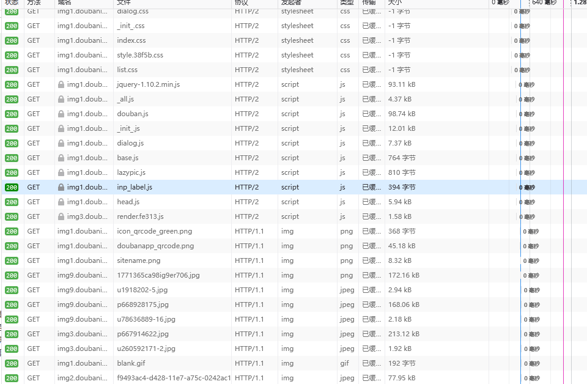
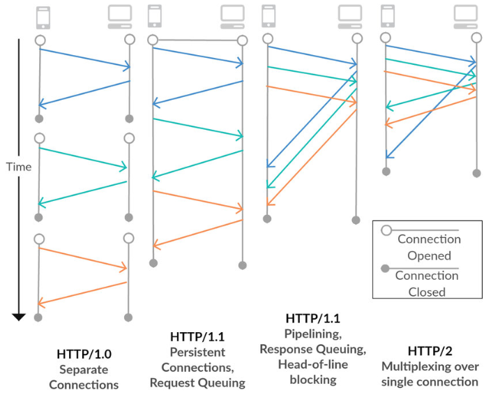
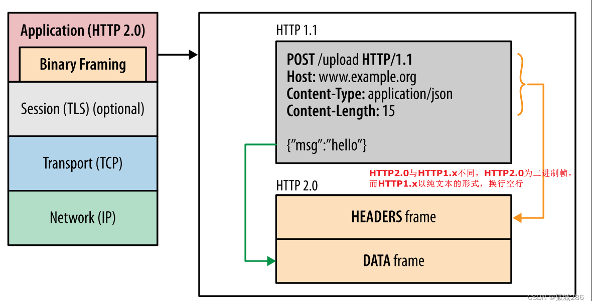
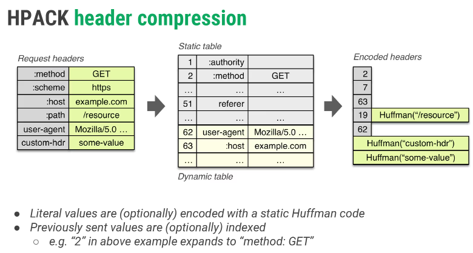

## 响应头、请求头
### 响应头
HTTP响应头是服务器端发送给客户端的HTTP头信息部分，它包含了关于服务器的信息和响应的信息。响应头是由服务器生成的，然后发送给客户端。响应头包含了HTTP响应的状态码、HTTP版本、服务器信息、内容类型、内容长度、内容编码、内容过期时间等信息。他们以键值对的形式出现，每个键值对由一个标头字段名和一个标头字段值组成，中间用冒号分隔。
```js
Access-Control-Allow-Origin: *
Content-Type: text/html; charset=utf-8
Cache-Control: no-cache
```
### 响应头和跨域
跨域资源共享（CORS）是一种机制，它使用额外的HTTP头来告诉浏览器，让运行在一个 origin（domain）上的Web应用被准许访问来自不同源服务器上的指定的资源。当一个资源从与该资源本身所在的服务器不同的域、协议或端口请求一个资源时，资源会发起一个跨域HTTP请求。
:::warning
CORS是一个W3C标准，它允许浏览器向跨源服务器，发出XMLHttpRequest请求，从而克服了AJAX只能同源使用的限制。
同源策略要求两个页面具有相同的协议、端口和域名，如果不满足这三个条件，就是跨域。
:::
```js '*'支持所有的的请求源 容易被攻击
Access-Control-Allow-Origin: *
```
```js Origin: http://www.example.com // 请求源
Access-Control-Allow-Origin: http://www.example.com // 允许的请求源
```
### 请求头
默认情况下CORS只支持客户端向服务器发送九个请求头，如果需要发送其他请求头，需要在请求头中添加
1. Accept：指定客户端能够接收的内容类型
2. Accept-Language：指定客户端当前的语言
3. Content-Language：请求的内容采用的语言
4. Content-Type：请求的与实体对应的MIME信息
5. Cookie：当前页面设置的任何Cookie
6. Origin：请求源
7. Referer：该请求是从哪个页面发过来的
8. User-Agent：浏览器的用户代理字符串
9. Authorization
```js
Access-Control-Request-Headers: X-PINGOTHER, Content-Type
``` 
#### 请求方法支持
默认只支持GET、POST、HEAD、OPTIONS请求，如果需要支持其他请求方法，需要在响应头中添加
如果我们要遵循restful风格，我们需要支持DELETE、PUT、PATCH等请求方法
:::tip restful风格
RESTful是一种软件架构风格，是一种设计风格而不是标准，只是提供了一组设计原则和约束条件。REST是Representational State Transfer的缩写，中文意思是表现层状态转化。RESTful是REST的具体实现。
:::
```js
Access-Control-Allow-Methods: GET, POST, PUT, DELETE, PATCH
```

### 预检请求
预检请求主要是为了解决跨域请求中的安全问题，浏览器会先发送一个OPTIONS请求，然后根据服务器返回的响应，决定是否发送真正的请求。
:::tip 预检请求触发条件
1. 使用了非简单请求方法，如PUT、DELETE、CONNECT、OPTIONS、TRACE、PATCH
2. 使用了非简单请求头，如Content-Type、Authorization、Accept
3. 请求中的Content-Type不是application/x-www-form-urlencoded、multipart/form-data、text/plain
:::
```js
//预检请求 OPTIONS 请求 浏览器发起的
//满足一下条件才会发起
//1.请求方法是PUT、DELETE、PATCH
//2.请求头中有自定义字段
//3.请求头中有Content-Type

app.post('/info', (req, res) => {
    res.json({
        code: 200,
        type:'post'
    })
})
```
```js
        fetch('http://localhost:3000/info',).then(response => {
            let headers = response.headers
            console.log(headers.get('xmzs'));
            return response.json();
        }).then(data => {
            console.log(data);
        })
```
### 自定义请求头
在请求头中添加自定义请求头，需要在响应头中添加Access-Control-Expose-Headers字段，告诉浏览器哪些自定义请求头可以暴露给客户端
```js
app.get('/info', (req, res) => {
    res.set('xmzs','132456')
    res.setHeader('Access-Control-Expose-Headers','xmzs')
    res.json({
        code: 200,
        type:'get'
    })
})
```
```js
        fetch('http://localhost:3000/info',).then(response => {
            let headers = response.headers
            console.log(headers.get('xmzs'));
            return response.json();
        }).then(data => {
            console.log(data);
        })
```

## HTTP2
### 判断HTTP1和HTTP2

### HTTP2的优势
1. 多路复用(Multiplexing): HTTP/2只需要一个连接就可以实现多个请求和响应，而HTTP/1.1每个请求都需要建立一个连接。

2. 二进制分帧: HTTP/2在应用层和传输层之间增加了一个二进制分帧层，将所有传输的信息分割为更小的消息和帧，并对它们进行二进制编码。

3. 头部压缩: HTTP/2使用HPACK算法对首部进行压缩，减少了首部的大小。


## 浏览器缓存
:::tip
浏览器缓存分为强缓存和协商缓存，强缓存是根据http头信息来判断是否使用缓存，协商缓存是根据服务器返回的状态码来判断是否使用缓存。
:::
### 强缓存
强缓存之后，浏览器不会向服务器发送请求，而是从浏览器分别读取内存缓存和硬盘缓存中获取资源，所以强缓存是可以直接使用的，不会发起请求，状态码为200。
1. 内存缓存和硬盘缓存
- memory cache: 内存缓存，存储在浏览器内存当中，一般刷新网页会发现很多内存缓存，主要用于缓存css和js文件，内存缓存虽然读取高效，但是缓存空间小，且一旦关闭浏览器就会被清除。
- disk cache: 硬盘缓存，存储在硬盘中，一般存储一些静态资源，如图片、音频、视频等，硬盘缓存虽然读取速度慢，但是容量大，而且可以持久保存。

2. Expires
Expires是HTTP/1.0的产物，表示资源过期时间，浏览器再次加载资源时，会根据资源的过期时间判断是否发送请求到服务器。Expires是服务器返回的响应头字段，告诉浏览器在过期时间前可以直接从浏览器缓存中获取资源，而无需再次请求。Expires是一个绝对时间，即使本地时间和服务器时间存在偏差，也不会影响缓存的使用。
- Expires 该字段制定缓存的到期时间
- 判断机制：当客户端请求资源时，或获取本地时间戳，与Expires进行比较，如果本地时间戳小于Expires时间戳，则直接使用缓存，否则向服务器请求资源。
```js
//动态资源缓存 接口
//Expires 强缓存
app.get('/api',(req,res)=>{
    res.setHeader('Expires',new Date(Date.now()+1000).toUTCString())
    res.send('Expires')
})
```
3.cache-control
Cache-Control是HTTP/1.1的产物，优先级高于Expires，当Cache-Control与Expires同时存在时，Cache-Control优先级高。Cache-Control的值有多种，常见的值如下：
- public: 表示响应可以被客户端和代理服务器缓存
- private: 表示响应只能被客户端缓存，而不能被代理服务器缓存
- no-cache: 表示不使用强缓存，需要使用协商缓存
- no-store: 表示不使用任何缓存，即不进行缓存存储
- max-age: 表示资源在本地缓存多少秒
- s-maxage: 覆盖max-age，作用于代理服务器缓存
- must-revalidate: 表示客户端必须验证缓存，即发送请求到服务器确认资源是否有更新 
- proxy-revalidate: 与must-revalidate类似，但只作用于代理服务器缓存
- no-transform: 代理服务器不得对资源进行转换
- immutable: 表示资源不会发生改变，可以直接使用缓存
- stale-while-revalidate: 表示资源过期后，依然可以使用缓存，但同时发起请求到服务器更新资源
- stale-if-error: 表示资源过期后，依然可以使用缓存，但是当资源失效时，返回错误码
```js
//Cache-Control 强缓存
//PUBLIC 共有缓存 任何服务器都可以缓存包括代理服务器 CDN
//PRIVATE 私有缓存 只有浏览器可以缓存
//MAX-AGE=60 60秒后过期
//Expires 和 Cache-Control 同时存在时 Cache-Control的max-age 优先级高
app.get('/api1',(req,res)=>{
    res.setHeader('Cache-Control','public,max-age=10')
    res.send('Cache-Control')
})
```
:::warning
强缓存和协商缓存是可以一起使用的，强缓存优先级高于协商缓存，即当强缓存生效时，浏览器直接使用缓存，不会再发起请求到服务器。
:::

### 协商缓存
协商缓存是强缓存失效后，浏览器携带缓存标识向服务器发送请求，由服务器根据缓存标识决定是否使用缓存的过程。协商缓存可以分为两种情况：
1. Last-Modified和If-Modified-Since
```js
//强缓存与协商缓存一起出现，浏览器优先使用强缓存
//如何解决这个问题
//no-cache 告诉浏览器，不要使用强缓存，要使用协商缓存
//no-store 告诉浏览器，不要使用任何缓存
//last-modified 设置资源最后修改时间

const getFileModifyTime = (filePath) => {
    return fs.statSync('./index.js').mtime.toUTCString()
}
app.get('/api2', (req, res) => {
    res.setHeader('Cache-Control', 'no-cache')
    const fileModifyTime = getFileModifyTime()
    const ifModifiedSince = req.headers['if-modified-since']
    if (ifModifiedSince && ifModifiedSince === fileModifyTime) {
        console.log('协商缓存命中');
        
        res.statusCode = 304
        res.send('Not Modified')
        res.end()
        return
    }
    console.log('没有缓存');
    res.setHeader('Last-Modified', fileModifyTime)
    res.send('Cache-Control')
})
```
2. Etag和If-None-Match
```js
//Etag 和 If-None-Match
//Etag 是服务器生成的资源唯一标识
//If-None-Match 浏览器发送请求时，携带上次资源的Etag
//服务器根据If-None-Match判断资源是否更新，如果没有更新，返回304，否则返回新的资源
const getFileEtag = (filePath) => {
    return crypto.createHash('md5').update(fs.readFileSync(filePath)).digest('hex')
}
app.get('/api3', (req, res) => {
    res.setHeader('Cache-Control', 'no-cache')
    const fileEtag = getFileEtag('./index.js')
    const ifNoneMatch = req.headers['if-none-match']
    if (ifNoneMatch && ifNoneMatch === fileEtag) {
        console.log('协商缓存命中');
        res.statusCode = 304
        res.send('Not Modified')
        res.end()
        return
    }
    console.log('没有缓存');
    res.setHeader('Etag', fileEtag)
    res.send('Cache-Control')
})
```

## OSI七层模型

1. 物理层：主要作用是定义物理设备如何传输数据，包括传输介质、接口、传输速率等。
- 有限信道：双绞线、同轴电缆、光纤等
- 无限信道：无线电波、红外线等
:::tip
物理层的主要作用是传输`比特流`，不关心数据的含义，只关心数据的传输。
:::
2. 数据链路层：主要作用是将比特流组装成帧和在帧之间传输，以及差错检测和纠正。
使用MAC地址来标识设备，通过交换机进行数据传输。
- 帧：数据链路层的数据传输单位，包括数据和控制信息
- 差错检测：奇偶校验、CRC校验等
- 差错纠正：海明码、纠错码等
:::tip
数据链路层的主要作用是传输`帧`，并检测和纠正传输过程中的错误。
:::
3. 网络层：主要作用是将数据包从源主机传输到目的主机，包括寻址、路由选择、分组转发等。
使用IP地址来标识设备，通过路由器进行数据传输。
    - 寻址：对网络层而言使用IP地址来标识设备，依靠IP地址来确定数据包的目的地。
    - 路由：在同一个网络中，不需要网络层的路由功能，只需要数据链路层的交换机功能，而在不同网络中，需要网络层的路由功能。
4. 传输层：主要作用定义端口号，以及控流，和校检。
有两个主要的传输协议：TCP和UDP
    - TCP：面向连接的可靠传输协议，提供可靠的数据传输，保证数据的完整性和顺序性。
    - UDP：面向无连接的不可靠传输协议，提供高效的数据传输，但不保证数据的完整性和顺序性。
:::tip
传输层的主要作用是传输`报文`，并控制数据的传输。
:::
5. 会话层：主要作用是建立、管理和终止会话，包括会话的建立、会话的管理、会话的终止等。 
:::tip
会话层包含了一种称为检查点的机制，可以在通信过程中进行检查点的设置，以便在通信中断后，可以从检查点重新开始通信。
:::
6. 表示层：主要作用是数据的格式化、加密、压缩等，以便应用层能够正确解释数据。
    1. 安全性：数据加密、数据解密
    2. 数据格式：数据压缩、数据解压缩
:::tip
表示层的主要作用是对数据进行`格式化`，以便应用层能够正确解释数据。
:::
7. 应用层：主要作用是为用户提供应用服务，包括文件传输、电子邮件、远程登录等。
例如ajax调用接口发送http请求，DNS，SMTP

## TCP三次握手
TCP是一种面向连接的可靠传输协议，它通过三次握手建立连接，通过四次挥手断开连接。

:::tip
1. seq (sequence number)：序列号，用来标识数据段的顺序
2. ack (acknowledgement number)：确认号，用来确认数据段是否收到 ack=seq+1
3. SYN (synchronize)：同步序列号，用来建立连接
:::
### 流程
1. 客户端向服务器发送SYN报文，请求建立连接
2. 服务器收到SYN报文，回复SYN+ACK报文，表示同意建立连接
3. 客户端收到SYN+ACK报文，回复ACK报文，表示连接建立成功
4. 服务器收到ACK报文，连接建立成功

## TCP四次挥手
TCP四次挥手是指断开一个TCP连接时，需要发送四个包，使得连接两端都能关闭连接。
四次挥手的具体步骤
- 第一次挥手‌：客户端发送一个带有FIN标志的TCP包给服务器，表示客户端没有数据要发送了，但仍然可以接收数据。服务器收到后，发送一个ACK包进行确认，并进入CLOSE_WAIT状态，客户端进入FIN_WAIT_1状态。‌
- 第二次挥手‌：服务器发送一个ACK包给客户端，确认收到FIN包，并进入CLOSE_WAIT状态。客户端收到ACK包后，进入FIN_WAIT_2状态。
- 第三次挥手‌：服务器发送FIN包给客户端，表示服务器也没有数据要发送了，客户端收到后发送ACK包进行确认，并进入TIME_WAIT状态。服务器进入LAST_ACK状态。
- 第四次挥手‌：客户端发送最后一个ACK包给服务器，确认服务器的FIN包，服务器收到后进入CLOSED状态。客户端需要等待一段时间（通常是2倍的最大段生命周期MSL），如果没有收到服务器的重传FIN+ACK，则认为连接已关闭，最终也进入CLOSED状态。

## 浏览器输入URL发生了什么
- URL解析
:::tip
URL解析主要包括协议、域名、端口、路径、查询参数、锚点等信息。
:::
- DNS解析
DNS是域名对IP的映射
:::tip
DNS解析是将域名解析为IP地址的过程，浏览器会先查找本地缓存，如果本地缓存没有，会向DNS服务器发送请求，获取域名对应的IP地址。
- 浏览器缓存：浏览器会将DNS解析的结果缓存到本地，下次再次访问相同的域名时，会直接从本地缓存中获取IP地址。
- 操作系统缓存：操作系统也会将DNS解析的结果缓存到本地，下次再次访问相同的域名时，会直接从操作系统缓存中获取IP地址。
- 本地Host文件：本地Host文件是一个域名和IP地址的映射表，当浏览器访问一个域名时，会先查找本地Host文件，如果本地Host文件中有对应的IP地址，会直接使用本地Host文件中的IP地址。
:::
:::tip 向域名服务器发送请求
1. 根域名服务器：根域名服务器是最高级别的域名服务器，它负责管理顶级域名服务器，如.com、.cn、.org等。
2. 顶级域名服务器：顶级域名服务器是负责管理顶级域名的域名服务器，如.com域名服务器、.cn域名服务器、.org域名服务器等。
3. 权威域名服务器：权威域名服务器是负责管理域名的域名服务器，如baidu.com域名服务器、google.com域名服务器等。
:::
:::tip options请求
- 预检请求：预检请求是CORS中的一种请求，主要用于检查服务器是否支持跨域请求。
- 预检请求触发条件：预检请求主要是为了解决跨域请求中的安全问题，浏览器会先发送一个OPTIONS请求，然后根据服务器返回的响应，决定是否发送真正的请求。
- 预检请求触发条件：使用了非简单请求方法，如PUT、DELETE、CONNECT、OPTIONS、TRACE、PATCH；使用了非简单请求头，如Content-Type、Authorization、Accept；请求中的Content-Type不是application/x-www-form-urlencoded、multipart/form-data、text/plain。
:::
- TCP连接
:::tip
TCP连接是一种面向连接的可靠传输协议，它通过三次握手建立连接，通过四次挥手断开连接。
::: 
- 发送HTTP请求
:::tip
HTTP请求主要包括请求行、请求头、请求体等信息，请求行包括请求方法、请求路径、请求协议等信息，请求头包括请求头字段和请求头字段值，请求体包括请求的数据。
:::
- 服务器处理请求
:::tip
服务器接收到HTTP请求后，会根据请求的路径、请求的方法等信息，来处理请求，然后返回响应。
:::
- 浏览器解析响应
:::tip
浏览器接收到服务器返回的响应后，会根据响应的状态码、响应的头信息、响应的数据等信息，来解析响应。
:::
- 缓存处理
:::tip
浏览器会根据响应的头信息，来判断是否使用缓存，如果使用缓存，会直接从缓存中获取数据，而不会再次请求服务器。
:::
- 渲染页面
:::tip
浏览器会根据响应的数据，来渲染页面，包括解析HTML、解析CSS、解析JS、渲染页面等。
- 绘制DOM树：浏览器会根据HTML标签来构建DOM树，DOM树是浏览器内部的一个数据结构，用来表示页面的结构。
- 构建CSSOM树：浏览器会根据CSS样式来构建CSSOM树，CSSOM树是浏览器内部的一个数据结构，用来表示页面的样式。
- 渲染页面：浏览器会根据DOM树和CSSOM树来渲染页面，包括布局、绘制、合成等。
:::
### 回流与重绘
- 回流：当页面中的元素发生变化，导致页面的布局发生变化时，浏览器会重新计算元素的位置和大小，然后重新绘制页面，这个过程称为回流。
- 重绘：当页面中的元素的样式发生变化，但是布局没有发生变化时，浏览器会重新绘制元素的样式，这个过程称为重绘。
回流是比重绘开销更大的一种操作，因为回流会导致页面的布局发生变化，需要重新计算元素的位置和大小，而重绘只需要重新绘制元素的样式。
:::
V8引擎会将JavaScript代码编译为字节码，然后再将字节码编译为机器码，最后再执行机器码。V8引擎是单线程的，所以JavaScript代码是单线程执行的，即同一时间只能执行一个任务。
:::tip
1. 宏任务：宏任务是由浏览器发起的任务，如定时器、事件等，宏任务会放到宏任务队列中，等待执行。
2. 微任务：微任务是由JavaScript发起的任务，如Promise、MutationObserver等，微任务会放到微任务队列中，等待执行。
:::


